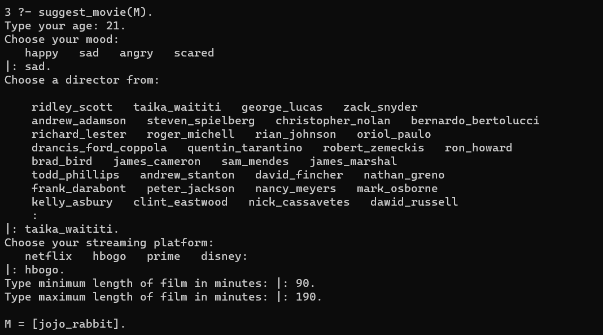
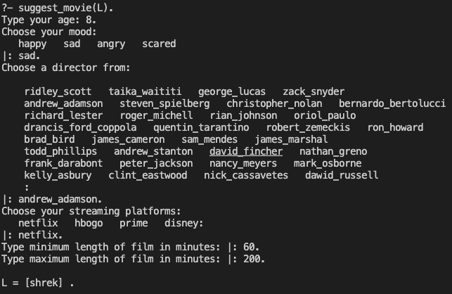

# Movie Night Expert

## Table of contents
- [Movie Night Expert](#movie-night-expert)
  - [Table of contents](#table-of-contents)
  - [Screenshots](#screenshots)
  - [Technologies](#technologies)
  - [Setup](#setup)
  - [Features](#features)
  - [Status](#status)
  - [Inspiration](#inspiration)


## Screenshots




## Technologies
* Prolog

## Setup
1. Run ```swipl``` command
2. Run ```[movie].``` to load the file
3. Run ```suggest_movie(M)``` to run the program
4. Answer the questions and get a movie to watch on Friday Night

## Features
Choosing movie by your preferences


## Status
Project is: _completed_.

## Inspiration
Project for Foundations of declarative programming classes in Prolog
